# 데모 계획에 맞춘 확장 ERD 설계안

## 1. 문서 목적

- 이 문서는 `Phase 1에서 실제로 구현할 것`과 `지금은 구현하지 않지만 ERD에는 유지할 것`을 함께 정리한다.
- 따라서 이 문서는 축소 ERD가 아니라 `확장 보존형 ERD 계획 문서`다.

## 2. 해석 원칙

- `Phase 1 구현 범위`는 검색, 상품, 장바구니, 주문, 모의 결제, 관리자 관측에 집중한다.
- 하지만 ERD는 향후 실험과 확장을 위해 다음 도메인을 다시 포함한다.
  - Articles
  - Inquiries
  - Coupons
  - Coins
  - Favorites
  - External Users
  - Citizen verification
  - section / channel 구조
- 배송은 여전히 Phase 1 구현 범위 밖이므로 이번 ERD에서는 핵심 보존 대상에서 제외한다.
- 관측과 장애 분석을 위해 모니터링 전용 엔티티는 별도로 유지한다.

## 2.1 네이밍 원칙

- 이 문서 세트에서는 `bbs`, `shopping` 같은 레거시 접두어를 제거하고, 도메인 의미가 바로 드러나는 직관적인 이름을 사용한다.
- 문서, ERD, 구현 초안 모두 가능한 한 같은 이름을 써서 이해 비용을 줄인다.
- 원본 쇼핑몰 ERD와의 대응이 필요할 때만 별도 매핑 표로 설명한다.

### 기본 원칙

- 접두어보다 엔티티 의미를 우선한다.
- 너무 추상적인 이름보다 역할이 바로 드러나는 이름을 쓴다.
- 퍼널 핵심 엔티티는 짧고 반복 가능한 이름을 쓴다.

### 예시

- `articles`
- `article_snapshots`
- `customers`
- `sales`
- `sale_snapshots`
- `cart_items`
- `orders`
- `order_items`
- `coupons`
- `monitoring_events`

### 권장 방침

- 문서와 구현 모두 직관적인 이름을 우선한다.
- 원본 ERD와의 차이는 설명용 매핑으로만 관리한다.
- 새로 작성하는 Prisma/SQL 초안도 같은 이름을 유지하는 편이 좋다.

## 3. 범위 구분

### 3.1 Phase 1 구현 핵심

- 상품 목록/상세
- 내부 검색
- 추천 플레이스홀더
- 장바구니 생성/수정
- 주문 생성
- 모의 결제 시도/결과
- 관리자 대시보드
- 모니터링 이벤트/로그/알림 기록

### 3.2 ERD 보존 도메인

- 게시판/아티클
- 상품 문의/리뷰
- 쿠폰
- 예치금/마일리지
- 즐겨찾기
- 외부 사용자
- 실명/시민 인증
- 채널/섹션/카테고리

### 3.3 여전히 제외하는 범위

- 실 PG 승인/정산
- 배송/운송/출고 상세
- 외부 검색 API
- 외부 추천 API
- 외부 AI API

## 4. 도메인별 유지 방향

| 도메인 | 이번 ERD에서의 위치 | 비고 |
|---|---|---|
| 상품/스냅샷 | 핵심 구현 + 핵심 보존 | 데모의 중심 |
| 장바구니/주문/모의 결제 | 핵심 구현 + 핵심 보존 | 퍼널 계측의 중심 |
| Channels / Sections / Categories | ERD 보존 | 단일 채널 구현으로 시작 가능 |
| Actors | ERD 보존 | 구현은 단순화하되 모델은 확장 가능하게 유지 |
| Articles | ERD 보존 | 문의/리뷰 기반 모델의 공통 기반 |
| Inquiries | ERD 보존 | 상품 문의/리뷰 흐름 확장용 |
| Coupons | ERD 보존 | 향후 전환 실험과 실패 시나리오 확장용 |
| Coins | ERD 보존 | 예치금/마일리지 관측 확장용 |
| Favorites | ERD 보존 | 행동 기반 분석 확장용 |
| Deliveries | 현재 제외 | 배송은 별도 phase에서 검토 |
| Monitoring | 핵심 구현 + 핵심 보존 | 데모 차별점 |

## 5. 문서 분기 안내

- 이 문서는 전체 관계를 보는 기준 문서다.
- 도메인별 세부 설명은 아래 하위 문서로 분기한다.

| 도메인 | 문서 |
|---|---|
| Articles | [`docs/planning/erd/01-articles.md`](erd/01-articles.md) |
| Systematic | [`docs/planning/erd/02-systematic.md`](erd/02-systematic.md) |
| Actors | [`docs/planning/erd/03-actors.md`](erd/03-actors.md) |
| Sales | [`docs/planning/erd/04-sales.md`](erd/04-sales.md) |
| Carts | [`docs/planning/erd/05-carts.md`](erd/05-carts.md) |
| Orders | [`docs/planning/erd/06-orders.md`](erd/06-orders.md) |
| Coupons | [`docs/planning/erd/07-coupons.md`](erd/07-coupons.md) |
| Coins | [`docs/planning/erd/08-coins.md`](erd/08-coins.md) |
| Inquiries | [`docs/planning/erd/09-inquiries.md`](erd/09-inquiries.md) |
| Favorites | [`docs/planning/erd/10-favorites.md`](erd/10-favorites.md) |
| Monitoring | [`docs/planning/erd/11-monitoring.md`](erd/11-monitoring.md) |

## 6. 권장 확장 ERD

```mermaid
erDiagram
"attachments" {
  String id PK
  String name
  String extension
  String url
  DateTime created_at
}

"articles" {
  String id PK
  DateTime created_at
  DateTime deleted_at
}

"article_snapshots" {
  String id PK
  String article_id FK
  String format
  String title
  String body
  DateTime created_at
}

"article_comments" {
  String id PK
  String article_id FK
  String parent_id FK
  DateTime created_at
  DateTime deleted_at
}

"article_comment_snapshots" {
  String id PK
  String article_comment_id FK
  String format
  String body
  DateTime created_at
}

"channels" {
  String id PK
  String code UK
  String name
  DateTime created_at
  DateTime updated_at
}

"channel_categories" {
  String id PK
  String channel_id FK
  String parent_id FK
  String code
  String name
  DateTime created_at
  DateTime updated_at
}

"sections" {
  String id PK
  String code UK
  String name
  DateTime created_at
  DateTime updated_at
}

"citizens" {
  String id PK
  String channel_id FK
  String mobile
  String name
  DateTime created_at
  DateTime deleted_at
}

"members" {
  String id PK
  String channel_id FK
  String citizen_id FK
  String nickname
  String password
  DateTime created_at
  DateTime updated_at
  DateTime withdrawn_at
}

"external_users" {
  String id PK
  String channel_id FK
  String citizen_id FK
  String application
  String uid
  String nickname
  String data
  String password
  DateTime created_at
}

"customers" {
  String id PK
  String channel_id FK
  String member_id FK
  String external_user_id FK
  String citizen_id FK
  String href
  String referrer
  String ip
  DateTime created_at
}

"sellers" {
  String id PK
  String member_id FK,UK
  DateTime created_at
  DateTime deleted_at
}

"administrators" {
  String id PK
  String member_id FK,UK
  DateTime created_at
  DateTime deleted_at
}

"addresses" {
  String id PK
  String mobile
  String name
  String country
  String province
  String city
  String department
  String possession
  String zip_code
  String special_note
  DateTime created_at
}

"sales" {
  String id PK
  String section_id FK
  String seller_customer_id FK
  DateTime created_at
  DateTime opened_at
  DateTime closed_at
  DateTime paused_at
  DateTime suspended_at
}

"sale_snapshots" {
  String id PK
  String sale_id FK
  DateTime created_at
}

"sale_snapshot_categories" {
  String id PK
  String sale_snapshot_id FK
  String channel_category_id FK
  Int sequence
}

"sale_snapshot_contents" {
  String id PK
  String sale_snapshot_id FK
  String title
  String format
  String body
  String revert_policy
}

"sale_snapshot_tags" {
  String id PK
  String sale_snapshot_id FK
  String value
  Int sequence
}

"sale_snapshot_units" {
  String id PK
  String sale_snapshot_id FK
  String name
  Boolean primary
  Boolean required
  Int sequence
}

"sale_snapshot_unit_options" {
  String id PK
  String sale_snapshot_unit_id FK
  String name
  String type
  Boolean variable
  Int sequence
}

"sale_snapshot_unit_option_candidates" {
  String id PK
  String sale_snapshot_unit_option_id FK
  String name
  Int sequence
}

"sale_snapshot_unit_stocks" {
  String id PK
  String sale_snapshot_unit_id FK
  String name
  Float nominal_price
  Float real_price
  Int quantity
  Int sequence
}

"carts" {
  String id PK
  String customer_id FK
  String actor_type
  DateTime created_at
  DateTime deleted_at
}

"cart_items" {
  String id PK
  String cart_id FK
  String sale_snapshot_id FK
  Int volume
  Boolean published
  DateTime created_at
  DateTime deleted_at
}

"cart_item_stocks" {
  String id PK
  String cart_item_id FK
  String sale_snapshot_unit_id FK
  String sale_snapshot_unit_stock_id FK
  Int quantity
  Int sequence
}

"cart_item_stock_choices" {
  String id PK
  String cart_item_stock_id FK
  String sale_snapshot_unit_option_id FK
  String sale_snapshot_unit_option_candidate_id FK
  String value
  Int sequence
}

"orders" {
  String id PK
  String customer_id FK
  String address_id FK
  String name
  Float cash
  Float deposit
  Float mileage
  DateTime created_at
  DateTime deleted_at
}

"order_items" {
  String id PK
  String order_id FK
  String cart_item_id FK
  String seller_id FK
  Int volume
  Int sequence
  DateTime confirmed_at
}

"order_payments" {
  String id PK
  String order_id FK,UK
  String address_id FK
  String password
  DateTime created_at
  DateTime paid_at
  DateTime cancelled_at
}

"payment_attempts" {
  String id PK
  String order_id FK
  String status
  Float amount
  String failure_code
  DateTime started_at
  DateTime finished_at
}

"coupons" {
  String id PK
  String customer_id FK
  String actor_type
  String name
  String access
  Boolean exclusive
  String unit
  Float value
  Float threshold
  Int limit
  Boolean multiplicative
  DateTime created_at
  DateTime updated_at
  DateTime deleted_at
}

"coupon_tickets" {
  String id PK
  String customer_id FK
  String coupon_id FK
  DateTime created_at
  DateTime expired_at
}

"coupon_ticket_payments" {
  String id PK
  String coupon_ticket_id FK
  String order_id FK
  DateTime created_at
  DateTime deleted_at
}

"deposits" {
  String id PK
  String code UK
  String source
  Int direction
  DateTime created_at
  DateTime deleted_at
}

"deposit_histories" {
  String id PK
  String deposit_id FK
  String citizen_id FK
  String source_id
  Float value
  Float balance
  DateTime created_at
  DateTime cancelled_at
}

"mileages" {
  String id PK
  String code UK
  String source
  Int direction
  Float value
  DateTime created_at
  DateTime deleted_at
}

"mileage_histories" {
  String id PK
  String mileage_id FK
  String citizen_id FK
  String source_id
  Float value
  Float balance
  DateTime created_at
  DateTime cancelled_at
}

"sale_snapshot_inquiries" {
  String id PK,FK
  String sale_snapshot_id FK
  String customer_id FK
  String type
  DateTime created_at
  DateTime read_by_seller_at
}

"sale_snapshot_questions" {
  String id PK,FK
  Boolean secret
}

"sale_snapshot_reviews" {
  String id PK,FK
  String order_item_id FK
}

"sale_snapshot_inquiry_answers" {
  String id PK,FK
  String sale_snapshot_inquiry_id FK,UK
  String seller_customer_id FK
}

"sale_favorites" {
  String id PK
  String customer_id FK
  String sale_id FK
  String sale_snapshot_id FK
  DateTime created_at
  DateTime deleted_at
}

"sale_snapshot_inquiry_favorites" {
  String id PK
  String customer_id FK
  String sale_snapshot_inquiry_id FK
  String article_snapshot_id FK
  DateTime created_at
  DateTime deleted_at
}

"address_favorites" {
  String id PK
  String customer_id FK
  String address_id FK
  String title
  Boolean primary
  DateTime created_at
  DateTime deleted_at
}

"monitoring_events" {
  String id PK
  String event_name
  String entity_type
  String entity_id
  String request_id
  String user_id
  String payload_json
  DateTime created_at
}

"api_request_logs" {
  String id PK
  String request_id UK
  String customer_id FK
  String method
  String endpoint
  Int status_code
  Int latency_ms
  String error_code
  DateTime created_at
}

"alert_records" {
  String id PK
  String alert_name
  String severity
  String status
  String source_type
  String source_ref
  DateTime created_at
  DateTime resolved_at
}

"channel_categories" }o--|| "channels" : channel
"channel_categories" }o--o| "channel_categories" : parent
"members" }o--o| "citizens" : citizen
"external_users" }o--o| "citizens" : citizen
"customers" }o--o| "members" : member
"customers" }o--o| "external_users" : external_user
"customers" }o--o| "citizens" : citizen
"sellers" |o--|| "members" : member
"administrators" |o--|| "members" : member
"sales" }o--|| "sections" : section
"sales" }o--|| "customers" : sellerCustomer
"sale_snapshots" }o--|| "sales" : sale
"sale_snapshot_categories" }o--|| "sale_snapshots" : snapshot
"sale_snapshot_categories" }o--|| "channel_categories" : category
"sale_snapshot_contents" }o--|| "sale_snapshots" : snapshot
"sale_snapshot_tags" }o--|| "sale_snapshots" : snapshot
"sale_snapshot_units" }o--|| "sale_snapshots" : snapshot
"sale_snapshot_unit_options" }o--|| "sale_snapshot_units" : unit
"sale_snapshot_unit_option_candidates" }o--|| "sale_snapshot_unit_options" : option
"sale_snapshot_unit_stocks" }o--|| "sale_snapshot_units" : unit
"carts" }o--|| "customers" : customer
"cart_items" }o--|| "carts" : cart
"cart_items" }o--|| "sale_snapshots" : snapshot
"cart_item_stocks" }o--|| "cart_items" : commodity
"cart_item_stock_choices" }o--|| "cart_item_stocks" : stock
"cart_item_stock_choices" }o--|| "sale_snapshot_unit_options" : option
"cart_item_stock_choices" }o--o| "sale_snapshot_unit_option_candidates" : candidate
"orders" }o--|| "customers" : customer
"orders" }o--o| "addresses" : address
"order_items" }o--|| "orders" : order
"order_items" }o--|| "cart_items" : commodity
"order_payments" |o--|| "orders" : order
"payment_attempts" }o--|| "orders" : order
"coupons" }o--|| "customers" : creator
"coupon_tickets" }o--|| "coupons" : coupon
"coupon_tickets" }o--|| "customers" : customer
"coupon_ticket_payments" }o--|| "coupon_tickets" : ticket
"coupon_ticket_payments" }o--|| "orders" : order
"deposit_histories" }o--|| "deposits" : deposit
"deposit_histories" }o--|| "citizens" : citizen
"mileage_histories" }o--|| "mileages" : mileage
"mileage_histories" }o--|| "citizens" : citizen
"sale_snapshot_inquiries" |o--|| "articles" : base
"sale_snapshot_inquiries" }o--|| "sale_snapshots" : snapshot
"sale_snapshot_inquiries" }o--|| "customers" : customer
"sale_snapshot_questions" |o--|| "sale_snapshot_inquiries" : base
"sale_snapshot_reviews" |o--|| "sale_snapshot_inquiries" : base
"sale_snapshot_inquiry_answers" |o--|| "articles" : base
"sale_snapshot_inquiry_answers" }o--|| "sale_snapshot_inquiries" : inquiry
"article_snapshots" }o--|| "articles" : article
"article_comments" }o--|| "articles" : article
"article_comments" }o--o| "article_comments" : parent
"article_comment_snapshots" }o--|| "article_comments" : comment
"sale_favorites" }o--|| "customers" : customer
"sale_favorites" }o--|| "sales" : sale
"sale_favorites" }o--|| "sale_snapshots" : snapshot
"sale_snapshot_inquiry_favorites" }o--|| "customers" : customer
"sale_snapshot_inquiry_favorites" }o--|| "sale_snapshot_inquiries" : inquiry
"address_favorites" }o--|| "customers" : customer
"address_favorites" }o--|| "addresses" : address
"api_request_logs" }o--o| "customers" : customer
```

## 7. 도메인 설명

### 6.1 Articles

- 게시판과 댓글, 스냅샷 구조를 유지한다.
- 상품 문의/리뷰가 `articles` 계층을 재사용할 수 있도록 보존한다.
- 1차 구현에서는 실제 화면이 없더라도 모델은 유지한다.

### 6.2 Systematic

- `channels`, `channel_categories`, `sections`를 복원한다.
- 1차 구현은 단일 채널/단일 섹션으로 시작할 수 있지만, ERD는 다채널 확장 가능하게 유지한다.

### 6.3 Actors

- `customers`, `members`, `external_users`, `citizens`, `sellers`, `administrators`를 다시 유지한다.
- 구현은 단순 로그인으로 시작할 수 있지만, ERD는 외부 유저 유입과 실명 인증 확장성을 보존한다.

### 6.4 Sales

- 상품/스냅샷/옵션/재고/태그/콘텐츠 구조를 보존한다.
- 다만 Phase 1 구현은 이 중 `sale`, `snapshot`, `unit_stock` 중심으로 제한할 수 있다.

### 6.5 Carts / Orders

- 퍼널 핵심이므로 구현 범위와 ERD 보존 범위가 모두 겹친다.
- `order_payments`는 원본 호환성을 위해 유지하고, 별도 `payment_attempts`를 데모용 관측 엔티티로 추가한다.

### 6.6 Coupons / Coins / Favorites / Inquiries

- 이번 요청에 따라 모두 ERD에 복원한다.
- Phase 1 구현에서는 비활성 도메인일 수 있지만, 향후 전환 최적화와 실패 시나리오 확장에 중요하다.

### 6.7 Monitoring

- `monitoring_events`, `api_request_logs`, `alert_records`는 원본 ERD에는 없지만 현재 프로젝트 목적상 필수다.
- 이 엔티티들은 검색/주문/결제 흐름과 직접 연결되는 관측 표면을 제공한다.

## 8. 구현 관점의 사용법

| 구분 | 이번에 실제 구현 우선 | ERD만 우선 보존 |
|---|---|---|
| 상품/검색/장바구니/주문/모의 결제 | 예 | - |
| 채널/섹션/카테고리 | 부분 | 예 |
| External Users / Citizen verification | 아니오 | 예 |
| Articles / Inquiries | 아니오 | 예 |
| Coupons / Coins / Favorites | 아니오 | 예 |
| Monitoring 엔티티 | 예 | - |

## 9. 다음 단계

- 이 ERD를 기준으로 `Phase 1 실제 구현 테이블 목록`을 별도로 뽑는다.
- Prisma 또는 SQL 스키마 초안 작성 시, `구현 테이블`과 `보존 테이블`을 구분한다.
- `monitoring_events`와 `api_request_logs`를 `docs/operations/alerts.md` 및 `docs/operations/dashboards.md`와 직접 매핑한다.
