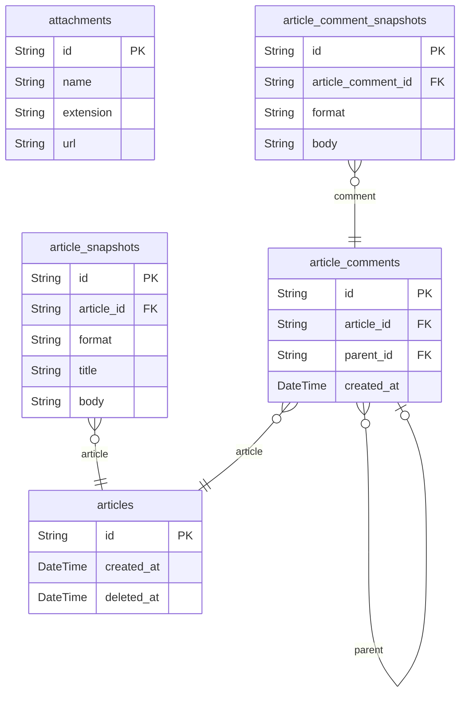

# Articles 도메인

## 역할

- 게시판, 공지, 일반 아티클, 댓글, 스냅샷형 본문을 담는 공통 콘텐츠 기반 도메인이다.
- 현재 계획에서는 직접 구현 우선순위가 높지 않지만, `Inquiries`와 후기/질문 계층의 기반으로 유지한다.

## 핵심 엔티티

- `attachments`
- `articles`
- `article_snapshots`
- `article_comments`
- `article_comment_snapshots`

## 도메인 ERD

## 왜 스냅샷 구조를 유지하는가

- 이 프로젝트의 원본 쇼핑몰 모델은 분쟁 대응과 이력 보존을 중요하게 본다.
- 아티클과 댓글을 수정할 때 원본을 덮어쓰지 않고 스냅샷을 남기면, 나중에 문의/리뷰/운영 로그와 연결하기 쉽다.

## 핵심 관계

- `articles` 1:N `article_snapshots`
- `articles` 1:N `article_comments`
- `article_comments` 1:N `article_comment_snapshots`
- `article_comments` self-reference로 대댓글 구조를 갖는다.

## Phase 1 구현 관점

- 직접 구현 대상은 아니다.
- 다만 `sale_snapshot_inquiries`와 연결되는 상위 기반이므로 모델은 유지한다.

## 모니터링 관점

- 향후 문의 폭증, 댓글 오류, 첨부 업로드 실패 같은 시나리오를 확장할 때 유용하다.
- 현재는 구조 보존 중심이며, 별도 SLI의 직접 대상은 아니다.
