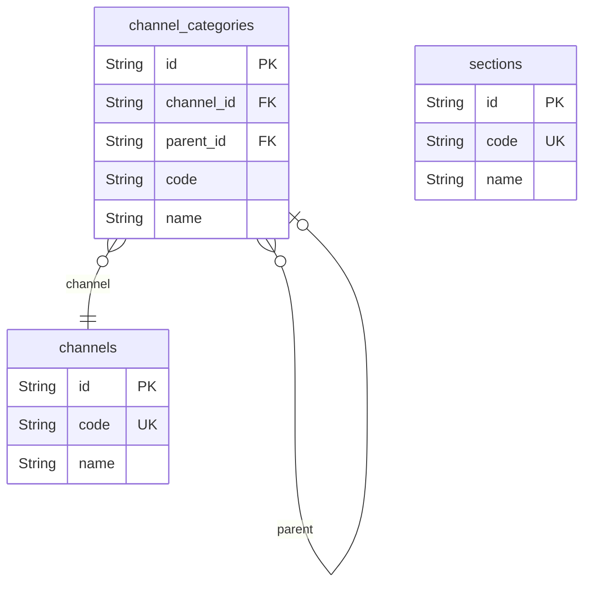

# Systematic 도메인

## 역할

- 채널, 섹션, 카테고리처럼 상품이 놓이는 체계를 정의한다.
- 단일 채널 데모로 시작할 수 있어도, ERD는 멀티 채널/멀티 카테고리 확장을 감당하도록 유지한다.

## 핵심 엔티티

- `channels`
- `channel_categories`
- `sections`

## 도메인 ERD

## 핵심 관계

- `channels` 1:N `channel_categories`
- `channel_categories` self-reference로 계층 카테고리 구성
- `sections`는 판매 상품이 속한 물리적/논리적 섹션 개념

## 설계 의도

- `채널`은 서비스 채널 구분
- `카테고리`는 검색/탐색/분류 구분
- `섹션`은 판매 구조나 운영 분류 구분

## Phase 1 구현 관점

- 단일 채널, 단일 섹션, 최소 카테고리로 시작 가능
- 하지만 `sale_snapshot_categories`와 연결되므로 모델은 유지하는 편이 낫다.

## 모니터링 관점

- 카테고리별 검색 실패율
- 채널별 주문 전환율
- 섹션별 상품 노출/판매 편차
같은 후속 지표 설계가 가능해진다.
