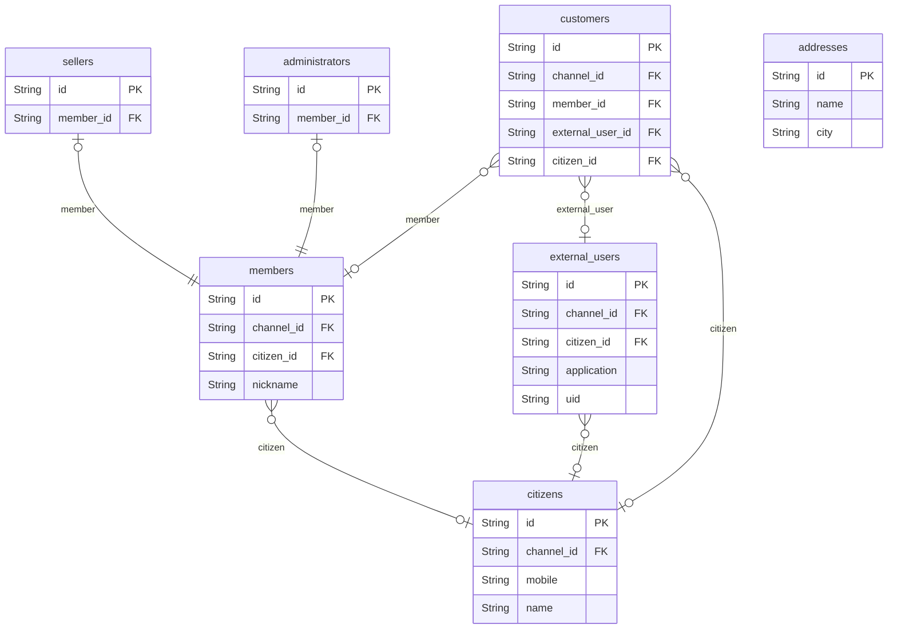

# Actors 도메인

## 역할

- 고객, 회원, 외부 사용자, 실명 인증 대상, 판매자, 관리자 등 행위 주체를 정의한다.
- 현재 구현은 단순 계정 구조로 시작해도 되지만, ERD는 다양한 유입 경로와 권한 구조를 보존한다.

## 핵심 엔티티

- `customers`
- `external_users`
- `citizens`
- `members`
- `sellers`
- `administrators`
- `addresses`

## 도메인 ERD

## 설계 의도

- `customers`는 사람 자체보다 접속/행동 단위를 나타낸다.
- `members`는 로그인 계정 중심 모델이다.
- `external_users`는 외부 시스템 유입 사용자 확장 포인트다.
- `citizens`는 실명/휴대폰 같은 인증 정보를 보존한다.
- `sellers`, `administrators`는 역할 분리용 서브타입이다.

## 핵심 관계

- `members` -> `sellers` / `administrators`
- `customers` -> `members`, `external_users`, `citizens`
- `addresses`는 주문 및 즐겨찾기 주소와 연결된다.

## Phase 1 구현 관점

- 실제 구현은 단순 로그인/역할 필드로 시작 가능
- ERD는 외부 유입과 인증 확장을 위해 현재 구조를 유지

## 모니터링 관점

- 역할별 요청량 비교
- 외부 유저 유입이 생겼을 때 referrer/href 기반 퍼널 분석
- 관리자 조작과 일반 사용자 행위를 구분한 감사 로그 확장
