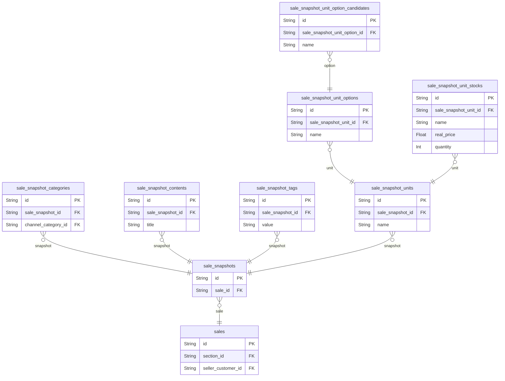

# Sales 도메인

## 역할

- 상품의 본체, 시점별 스냅샷, 카테고리, 콘텐츠, 태그, 옵션, 재고를 정의한다.
- 현재 데모의 핵심 구현 도메인이다.

## 핵심 엔티티

- `sales`
- `sale_snapshots`
- `sale_snapshot_categories`
- `sale_snapshot_contents`
- `sale_snapshot_tags`
- `sale_snapshot_units`
- `sale_snapshot_unit_options`
- `sale_snapshot_unit_option_candidates`
- `sale_snapshot_unit_stocks`

## 도메인 ERD

## 설계 의도

- `sales`는 판매 상품의 본체다.
- 실제 노출 정보와 주문 기준 정보는 `sale_snapshots`에 담는다.
- 옵션/후보/재고 구조는 다양한 상품 조합을 표현하기 위한 확장 모델이다.

## 핵심 관계

- `sales` 1:N `sale_snapshots`
- `sale_snapshots` 1:N `sale_snapshot_units`
- `sale_snapshot_units` 1:N `sale_snapshot_unit_options`
- `sale_snapshot_unit_options` 1:N `sale_snapshot_unit_option_candidates`
- `sale_snapshot_units` 1:N `sale_snapshot_unit_stocks`

## Phase 1 구현 관점

- 최소 구현은 `sales`, `sale_snapshots`, `sale_snapshot_unit_stocks` 중심으로 시작 가능
- 복잡한 옵션 트리는 점진적으로 활성화할 수 있다.

## 모니터링 관점

- 상품 상세 조회 수
- 검색 결과 노출 상품 수
- 재고 부족/검증 실패
- 특정 snapshot 또는 stock 기준의 결제 실패 패턴

## 중요 이유

- 현재 데모의 검색, 상세, 장바구니, 주문, 결제 퍼널은 모두 이 도메인에서 시작된다.
