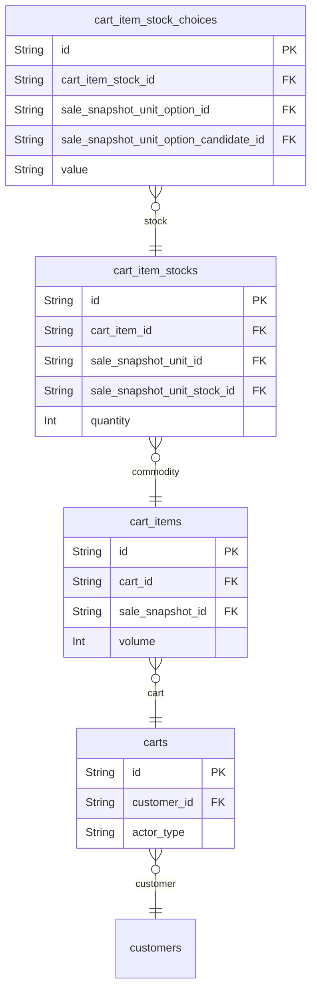

# Carts 도메인

## 역할

- 구매자가 상품을 담고 수정하는 중간 상태를 보관한다.
- 비즈니스 퍼널에서 전환과 이탈을 가장 잘 보여주는 도메인 중 하나다.

## 핵심 엔티티

- `carts`
- `cart_items`
- `cart_item_stocks`
- `cart_item_stock_choices`

## 도메인 ERD

## 설계 의도

- `carts`는 장바구니 자체
- `cart_items`는 어떤 판매 스냅샷을 담았는지
- `cart_item_stocks`는 실제 구매 대상 재고/옵션 수준의 선택
- `cart_item_stock_choices`는 옵션 선택 세부를 보존

## 핵심 관계

- `carts` 1:N `cart_items`
- `cart_items` 1:N `cart_item_stocks`
- `cart_item_stocks` 1:N `cart_item_stock_choices`

## Phase 1 구현 관점

- 필수 구현 대상이다.
- 초반에는 옵션 선택 로직을 단순화해도 장바구니 구조 자체는 유지하는 편이 좋다.

## 모니터링 관점

- 장바구니 담기 성공률
- 장바구니 수정 실패율
- 장바구니 -> 주문 전환율
- 옵션 선택 오류, 재고 검증 오류
