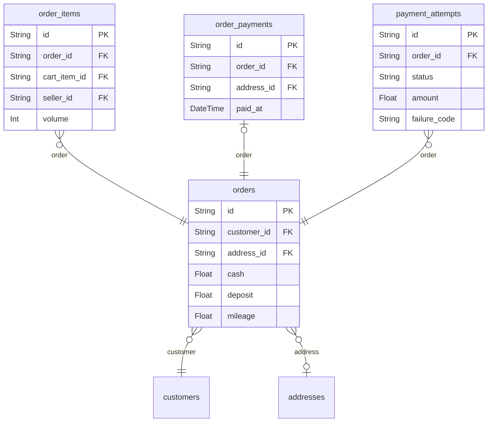

# Orders 도메인

## 역할

- 장바구니가 주문으로 전환되는 순간과 결제 직전/직후 상태를 담는다.
- 현재 데모의 가장 중요한 전환 지점이다.

## 핵심 엔티티

- `orders`
- `order_items`
- `order_payments`
- `payment_attempts`

## 도메인 ERD

## 설계 의도

- `orders`는 주문 신청 자체
- `order_items`는 주문에 포함된 개별 상품
- `order_payments`는 원본 호환성 유지용 결제 완료/발행 모델
- `payment_attempts`는 현재 데모에서 모의 결제 흐름을 단순하고 관측 가능하게 만들기 위한 보조 엔티티

## 핵심 관계

- `orders` 1:N `order_items`
- `orders` 1:1 `order_payments`
- `orders` 1:N `payment_attempts`

## Phase 1 구현 관점

- 필수 구현 대상이다.
- 실 PG 없이 `payment_attempts.status`, `failure_code`만으로 성공/실패 흐름을 만든다.

## 모니터링 관점

- 주문 생성 성공률
- 결제 시도 수
- 결제 실패율
- 실패 코드별 분포
- 주문 생성 후 결제 미진입 비율
