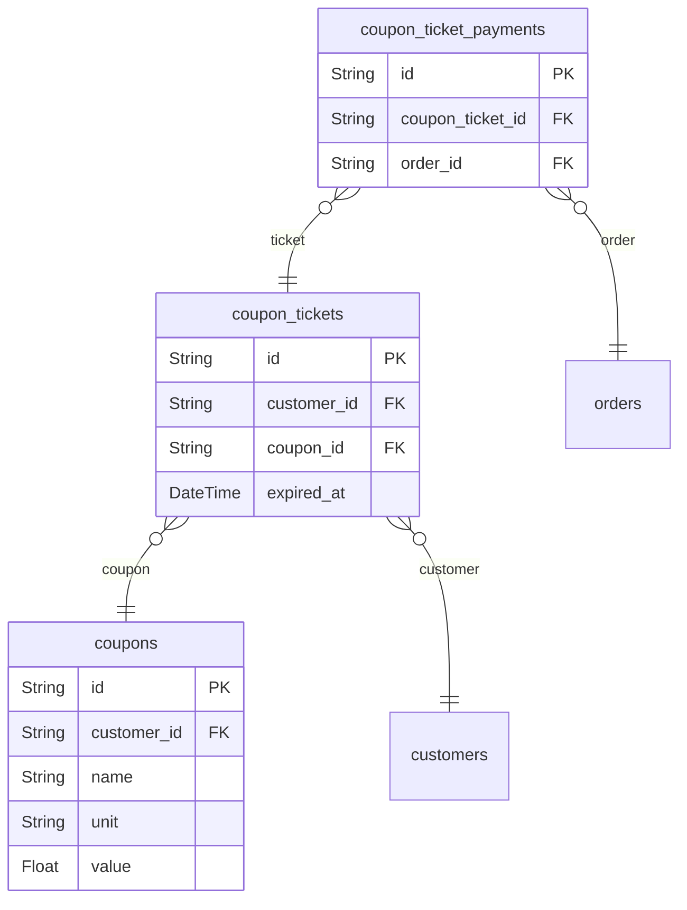

# Coupons 도메인

## 역할

- 할인 정책, 발급, 사용 이력을 담는다.
- 지금 당장은 구현 우선순위가 낮지만, 전환 실험과 실패 시나리오 확장에 중요한 도메인이다.

## 핵심 엔티티

- `coupons`
- `coupon_tickets`
- `coupon_ticket_payments`

## 도메인 ERD

## 설계 의도

- `coupons`는 쿠폰 정책 자체
- `coupon_tickets`는 사용자 발급 이력
- `coupon_ticket_payments`는 주문에 쿠폰이 사용된 흔적

## 핵심 관계

- `coupons` 1:N `coupon_tickets`
- `coupon_tickets` N:1 `customers`
- `coupon_ticket_payments`는 `coupon_tickets`와 `orders`를 연결한다.

## Phase 1 구현 관점

- 보존만 하고 실제 구현은 미룰 수 있다.
- 단, 추후 장바구니/주문 실패 시나리오에 “쿠폰 검증 실패”를 넣으려면 현재 유지가 유리하다.

## 모니터링 관점

- 쿠폰 적용 성공률/실패율
- 특정 조건 쿠폰의 사용 편향
- 쿠폰 검증 실패가 주문 전환에 미치는 영향
