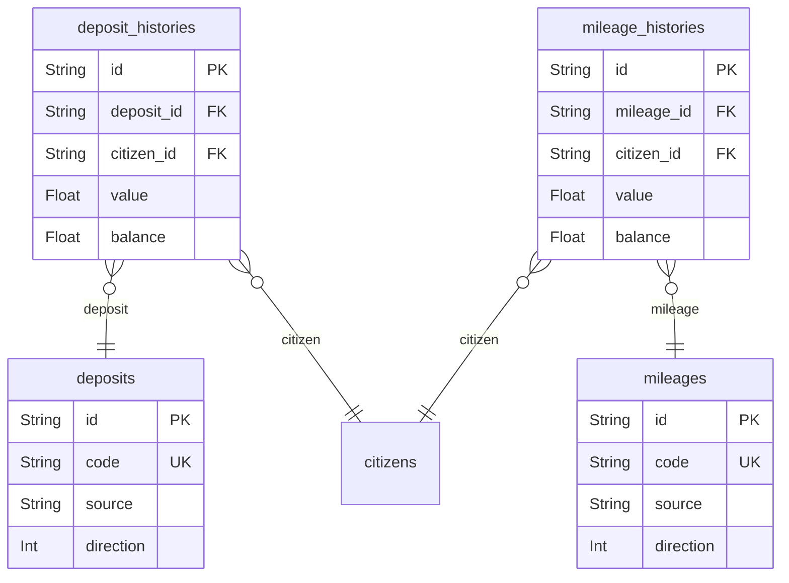

# Coins 도메인

## 역할

- 예치금과 마일리지 같은 내부 화폐 흐름을 표현한다.
- 현재 데모에서 직접 쓰이지 않아도, 향후 “돈을 벌기 위한 모니터링” 확장에 의미가 있다.

## 핵심 엔티티

- `deposits`
- `deposit_histories`
- `mileages`
- `mileage_histories`

## 도메인 ERD

## 설계 의도

- 메타 테이블과 이력 테이블을 분리해 회계성 추적을 쉽게 한다.
- 각 이벤트는 `source`와 `source_id`로 원인을 추적할 수 있다.

## 핵심 관계

- `deposits` 1:N `deposit_histories`
- `mileages` 1:N `mileage_histories`
- 두 이력 테이블 모두 `citizens`와 연결되어 사용자 잔액 흐름을 보존한다.

## Phase 1 구현 관점

- 구현하지 않아도 된다.
- 하지만 내부 결제 수단이 필요한 phase가 오면 비교적 자연스럽게 붙일 수 있다.

## 모니터링 관점

- 예치금 충전 실패
- 마일리지 적립/차감 이상
- 사용자 잔액 불일치
- 내부 화폐 사용이 전환에 미치는 영향
