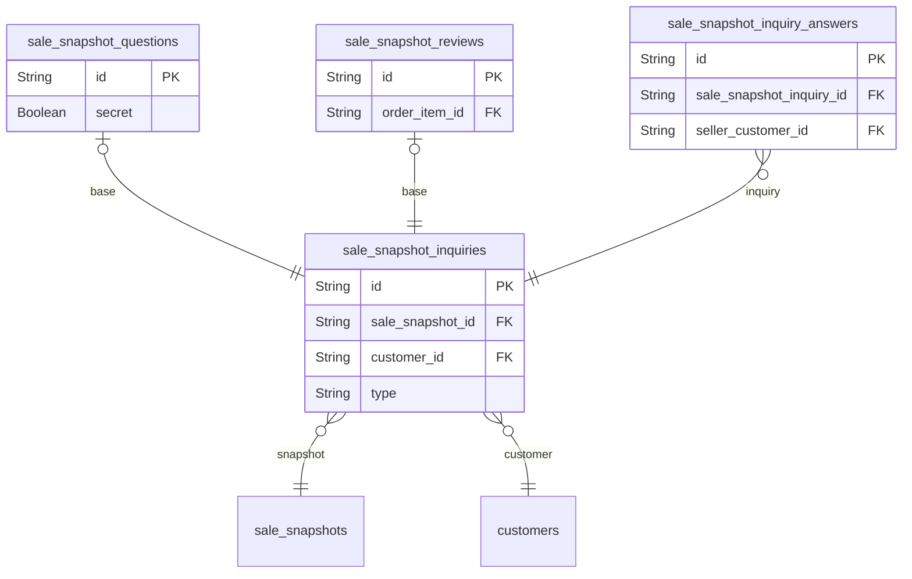

# Inquiries 도메인

## 역할

- 상품 문의와 리뷰를 표현한다.
- `Articles` 도메인 위에 얹히는 구조로, 상품 커뮤니케이션과 후기 시스템의 기반이다.

## 핵심 엔티티

- `sale_snapshot_inquiries`
- `sale_snapshot_questions`
- `sale_snapshot_reviews`
- `sale_snapshot_inquiry_answers`

## 도메인 ERD

## 설계 의도

- 질문과 리뷰를 하나의 상위 inquiry 구조로 묶는다.
- 상세 내용은 `articles`와 스냅샷 구조를 재사용한다.
- 판매자 응답과 읽음 상태까지 추적 가능하다.

## 핵심 관계

- `sale_snapshot_inquiries` -> `sale_snapshot_questions` / `sale_snapshot_reviews`
- `sale_snapshot_inquiry_answers`는 공식 판매자 응답

## Phase 1 구현 관점

- 직접 구현 대상은 아니다.
- 하지만 상품 상세 확장, 후기 품질, 문의 처리 분석이 필요해지면 바로 연결할 수 있다.

## 모니터링 관점

- 미답변 문의 적체
- 판매자 응답 지연
- 리뷰 작성률
- 문의/리뷰 급증에 따른 운영 부담
