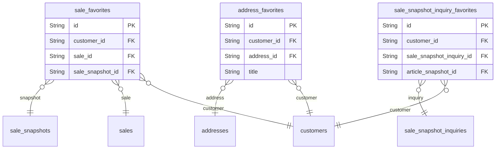

# Favorites 도메인

## 역할

- 사용자의 관심 신호를 저장한다.
- 구매 전 행동 분석과 추천 보조 지표에 활용될 수 있다.

## 핵심 엔티티

- `sale_favorites`
- `sale_snapshot_inquiry_favorites`
- `address_favorites`

## 도메인 ERD

## 설계 의도

- 상품, 문의, 주소를 각각 즐겨찾기할 수 있게 나눈다.
- 특히 상품 즐겨찾기는 향후 추천/전환 분석에 중요한 신호가 된다.

## 핵심 관계

- `sale_favorites`는 `customers`와 `sales`/`sale_snapshots`를 연결한다.
- `sale_snapshot_inquiry_favorites`는 사용자와 상품 문의를 연결한다.
- `address_favorites`는 사용자와 주소를 연결한다.

## Phase 1 구현 관점

- 직접 구현 대상은 아니다.
- 다만 추천 플레이스홀더 고도화나 행동 분석 확장에는 도움이 된다.

## 모니터링 관점

- 즐겨찾기 대비 구매 전환율
- 관심 신호가 많은데 구매로 이어지지 않는 상품군
- 주소 즐겨찾기 활용률
