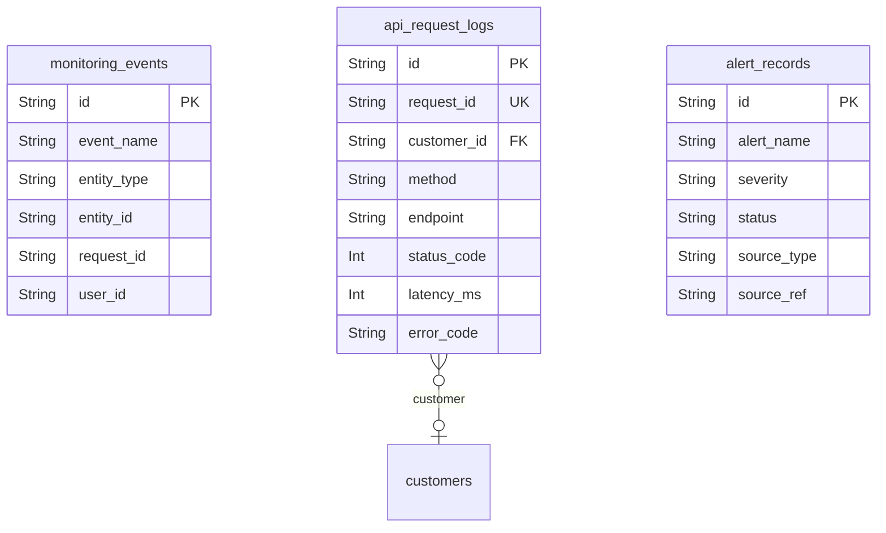

# Monitoring 도메인

## 역할

- 이 프로젝트를 원본 쇼핑몰 모델과 구분해 주는 핵심 확장 도메인이다.
- 서비스 이벤트, API 요청, 알림 이력을 기록해 `Grafana + Loki + Prometheus` 기반 관측을 보조한다.

## 핵심 엔티티

- `monitoring_events`
- `api_request_logs`
- `alert_records`

## 도메인 ERD

## 설계 의도

- `monitoring_events`는 도메인 이벤트를 구조화해 남긴다.
- `api_request_logs`는 endpoint, latency, error_code, request_id를 남겨 API 품질과 드릴다운을 연결한다.
- `alert_records`는 알림 이력과 요약 카드 연결 지점이 된다.

## 핵심 관계

- `api_request_logs.customer_id` -> 요청 주체 추적
- `monitoring_events.entity_type/entity_id` -> 상품, 장바구니, 주문, 결제 등과 연결
- `alert_records.source_type/source_ref` -> 어느 메트릭/로그/이벤트에서 알림이 왔는지 연결

## Phase 1 구현 관점

- 필수 구현 대상이다.
- 이 도메인이 없으면 현재 프로젝트의 핵심 가치인 관측성과 에이전트 요약이 약해진다.

## 모니터링 관점

- `event_name` 예시
  - `product.list_viewed`
  - `product.detail_viewed`
  - `search.executed`
  - `cart.item_added`
  - `order.created`
  - `payment.started`
  - `payment.failed`
- 이 도메인은 `docs/operations/alerts.md`와 `docs/operations/dashboards.md`의 지표 정의와 직접 매핑된다.
